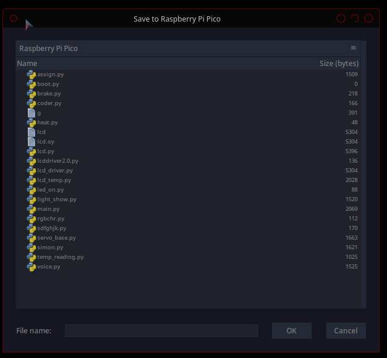

# Lcd-pico
## A driver for LCD displays, written in micropython for the rasberry pi pico

### Installation Instructions:

First clone the repository:
`git clone https://github.com/Dragonflame7155/lcd-pico.git`

Then, save the file "lcd-pico.py" as "lcd.py" to your raspberry pi pico

###Setup
Connect Pins 0-11 on your raspberry pi pico to your 16 pin lcd display as follows:\
Pin 0 -> RS\
Pin 1 -> RW\
Pin 2 -> E\
Pin 3 -> D0\
Pin 4 -> D1\
Pin 5 -> D2\
Pin 6 -> D3\
Pin 7 -> D4\
Pin 8 -> D5\
Pin 9 -> D6\
Pin 10 -> D7\
Now you can import the driver with `import lcd` and prefixing commands with `lcd.`

### Documentation
#### Write()
`write(message)` *Writes a string to the display only a-z, A-Z, 0-9, =, ., ?, and spaces are supported (for now)*

#### Dispchar()
`dispchar(char)` *Puts a single char on the screen, for use with the builtin variables containing the bits, not a character in the form of a string*
##### Available values  for `char`(any without a description will be displayed as the variable name)
a-z\
A-Z\
n0-n9 *numbers 0-9*\
spc *space*

*symbols*\
htg *hashtag*\
dlr *dollar sign*\
prc *percent sign*\
aps *apostrophe*\
fsh *foward slash*\
bsh *back slash*\
**All other values not listed here either dont work, or are not displayed correctly (fixes soon I promise)**

#### Clear()
`clear()` *Clears the display*

#### Dispcmd()
`dispcmd(cmd)` *Sends a command to the screen*\
##### Available Commands:
clr *clears the screen*\
rtn *returns cursor to the beginning of the line*

#### Lcd_init()
`lcd_init()` *Initializes the display*
